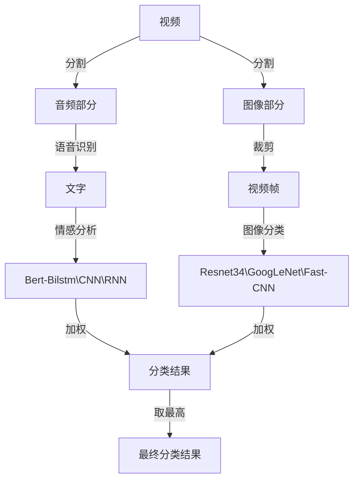

# 视频流在线情感分析

## 理论基础

提前将视频分成音频部分与图像部分,其中音频部分使用Kaldi\ESPNet\WeNet\Whisper进行识别,然后识别出来的中文文字使用Bert-Bilstm\CNN\RNN进行情感分析,视频部分裁剪成视频帧,然后使用Resnet34\GoogLeNet\Fast-CNN进行图片情感的分类,两者加权出一个分类结果,取最高的作为这一段视频的分类结果	

### 语音识别

### 情感标签

- 愤怒 angry
- 恐惧 fearful
- 开心 happy
- 无情感 neutral
- 悲伤 sad
- 恐惧 fearful

### 语言情感分类

使用数据集为SMP2020微博情绪分类评测,数据集发布在[网站](https://smp2020ewect.github.io/),到2024/10/16为 依然可以下载

原先是txt格式的json数据,为了方便处理使用python脚本(dataset\text2emo\process.py)处理成csv格式文件

使用到的网络为Bert-Bilstm/CNN/RNN

在语音分类之后在最终层输出每个分类结果的置信度,然后输入下一层用于加权使用

Bert-Bilstm 对应测试集acc率为 搞笑的50%不到 草（

RNN 对应测试集acc率为62.08%

CNN 对应测试集acc率为63.48%

### 图片帧情感分类

使用数据集为RAF,在[kaggle](https://www.kaggle.com/datasets/shuvoalok/raf-db-dataset/)上面可以找到,为100*100的低清图片,原数据集有7种情感标签,分别为happiness, neutral, sadness, anger, surprise, disgust, fear 为符合我们之前的语言情感分析的标签,删掉了disgust对应的数据集,保持6类情感标签与上述一致

识别部分主要使用CNN网络变形格式(Resnet34\GoogLeNet\Fast-CNN)进行图片帧的图像分类识别,同时在最后的全连接层输出对应的每一个类的分类结果置信度

前面两个模型是预训练CNN模型,最后的那个fast-CNN为手写cnn网络模型 目前训练出来的三个模型对应的测试集准确率为83.39%,83.36%,78.82%

可以看到预训练模型普遍优于我的垃圾手写深度神经网络模型

### 加权识别&视频情感分析

以一段话为分界线,分析该段文字内所含视频帧以及这句话的情感,每一帧识别出来的情感加上该段文字的情感,同时将图片帧和语音分类的结果各按照50%进行加权,输出置信度最高的那一个作为情感分类的结果,最终得到一段视频的情感结果,情感分析结果放在视频左上角

### 网页部署

TBC... 可能会用Gradio做网页端
