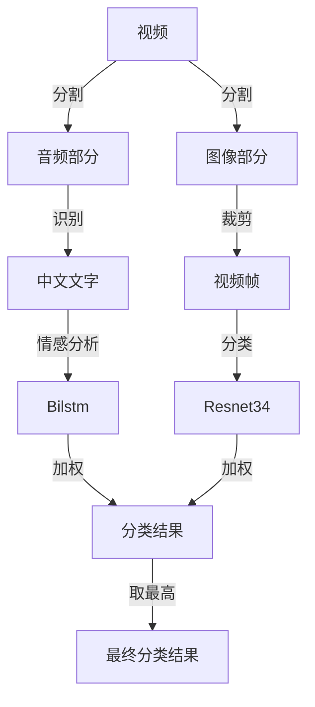

# 视频流在线情感分析

## 理论基础

提前将视频分成音频部分与图像部分,其中音频部分使用Kaldi\ESPNet\WeNet进行识别,然后识别出来的中文文字使用Bilstm\CNN进行情感分析,视频部分裁剪成视频帧,然后使用Resnet34\GoogLeNet进行图片情感的分类,两者加权出一个分类结果,取最高的作为这一段视频的分类结果	

### 语音识别

### 情感标签

- 愤怒
- 惊讶
- 开心
- 恐惧
- 悲伤
- 无情感

### 语言情感分类

使用数据集为SMP2020微博情绪分类评测,数据集发布在[网站]( https://smp2020ewect.github.io/),到2024/10/16为 依然可以下载

考虑到BERT-Bilstm对情感分析有先天性优势,因此将其作为其唯一的分类器 并在最终层输出每个分类结果的置信度,然后输入下一层用于加权使用

### 图片帧情感分类

