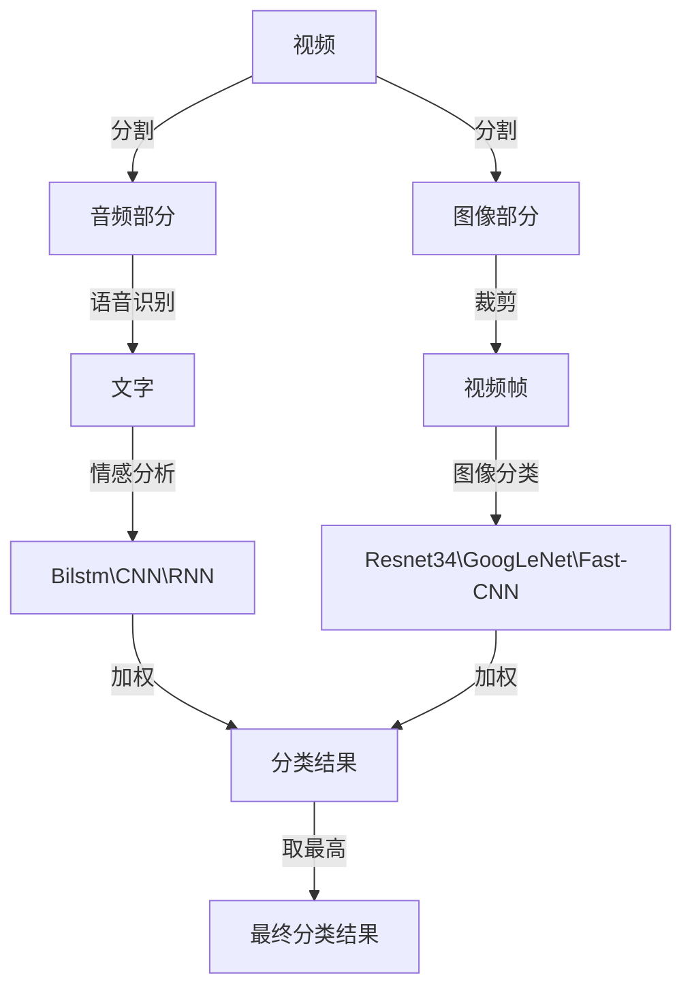

# 视频流在线情感分析

## 理论基础

提前将视频分成音频部分与图像部分,其中音频部分使用Kaldi\ESPNet\WeNet进行识别,然后识别出来的中文文字使用Bilstm\CNN\RNN进行情感分析,视频部分裁剪成视频帧,然后使用Resnet34\GoogLeNet\Fast-CNN进行图片情感的分类,两者加权出一个分类结果,取最高的作为这一段视频的分类结果	

### 语音识别

### 情感标签

- 愤怒
- 惊讶
- 开心
- 恐惧
- 悲伤
- 无情感

### 语言情感分类

使用数据集为SMP2020微博情绪分类评测,数据集发布在[网站]( https://smp2020ewect.github.io/),到2024/10/16为 依然可以下载

在语音分类之后在最终层输出每个分类结果的置信度,然后输入下一层用于加权使用

### 图片帧情感分类

主要使用CNN网络变形格式进行图片帧的图像分类识别,同时在最后的全连接层输出对应的每一个类的分类结果置信度

最后同时将图片帧和语音分类的结果各按照50%进行加权

输出置信度最高的那一个作为情感分类的结果